# Malazan Cube of the Fallen

**Full-width card gallery:** [Open on GitHub Pages](https://sfend.github.io/malazan-cube/) (or enable Pages below to use your own URL).

### GitHub Pages setup

1. In the repo: **Settings → Pages**.
2. Under **Source**, choose **Deploy from a branch**.
3. Branch: **main** (or **master**), folder: **/ (root)**. Save.
4. After a minute or two, the site will be at `https://<your-username>.github.io/malazan-cube/`.

The gallery uses `index.html` and `cards.json`. After adding or changing cards, run `.\render-all-cards.ps1` (it regenerates `cards.json`), then commit and push.

---

Card list (alphabetical, in-repo preview):

   
  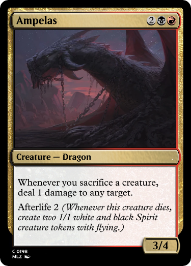 
   
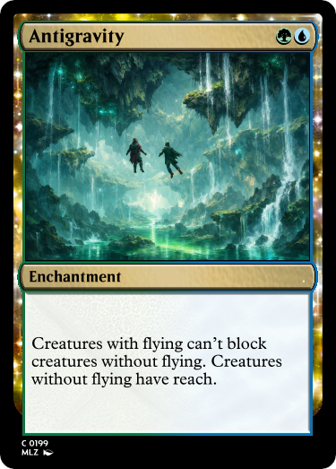 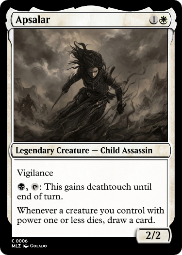 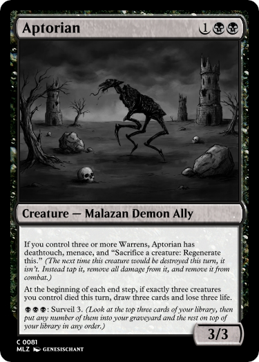 
 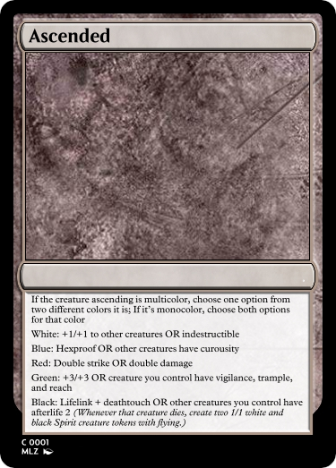  
  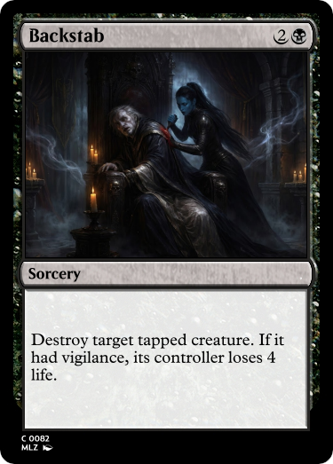 
  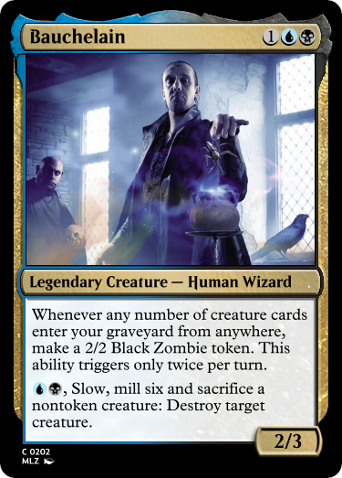 
   
   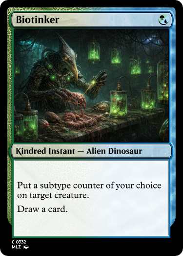
   
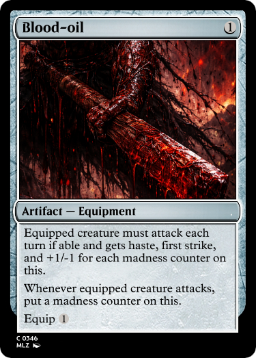   
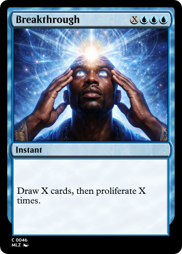   
   
   
 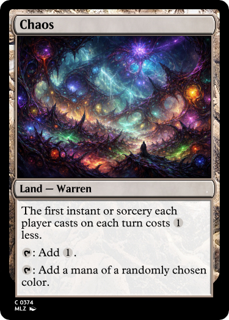  
   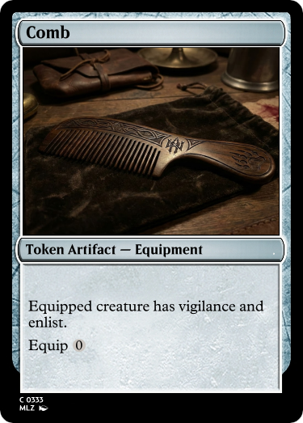
 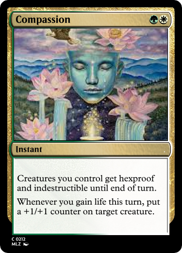 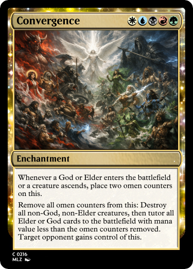 
   
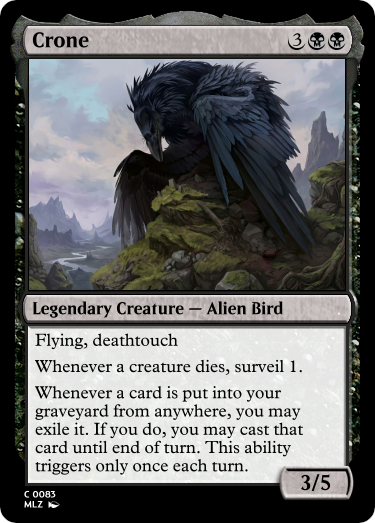  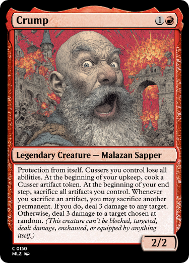 
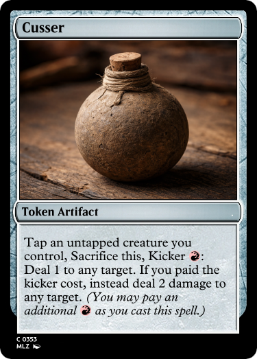   
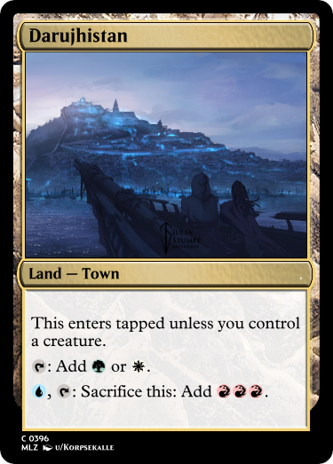   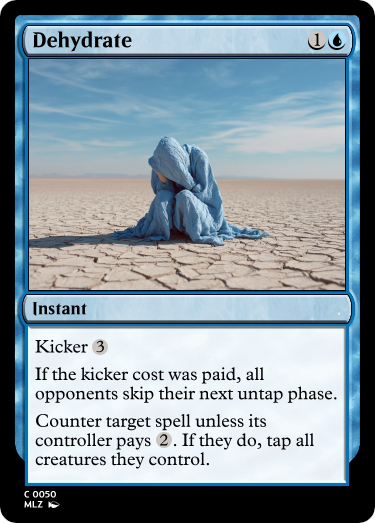
   
  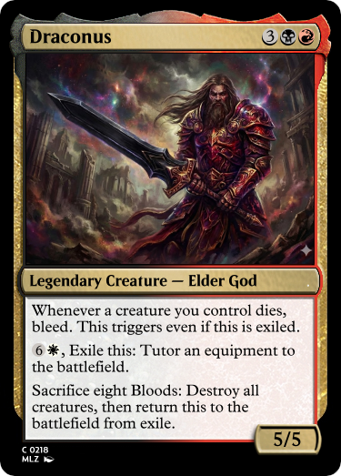 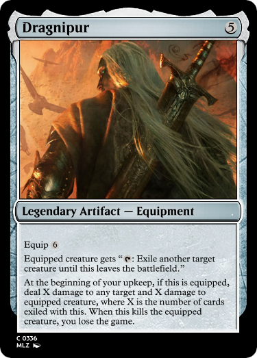
   
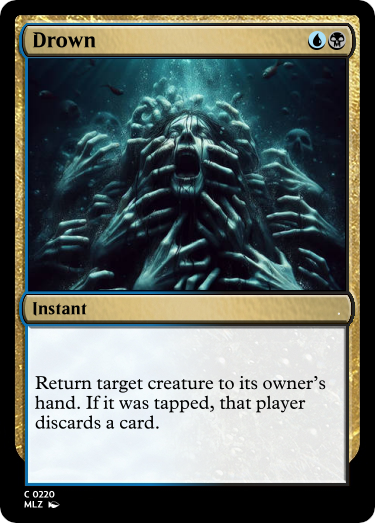   
   
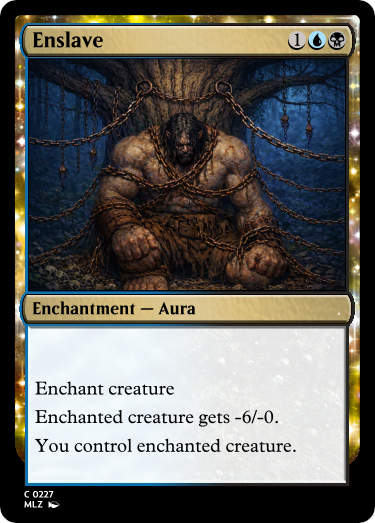   
   
   
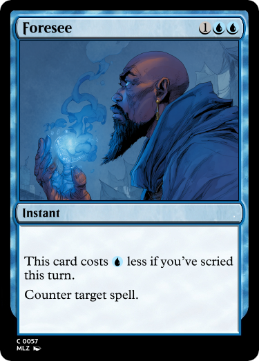   
   
   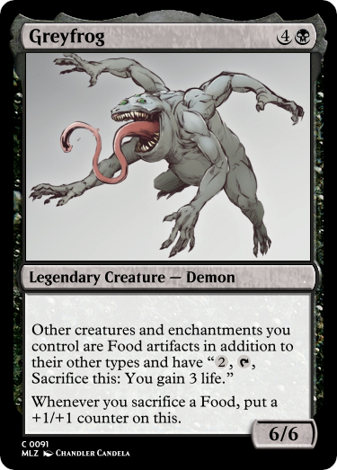
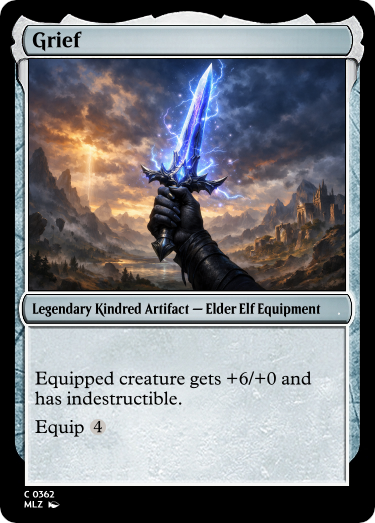   
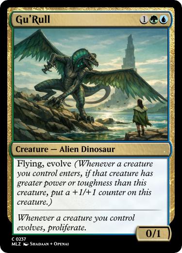  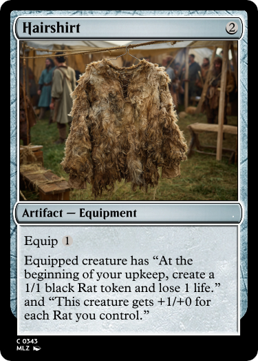 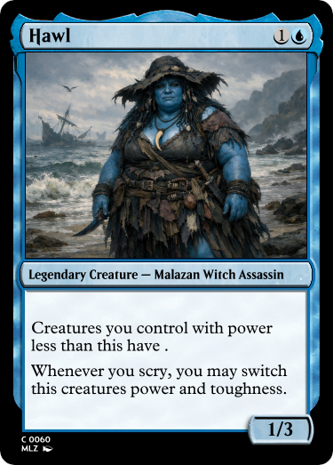
 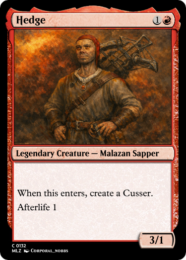  
   
   
  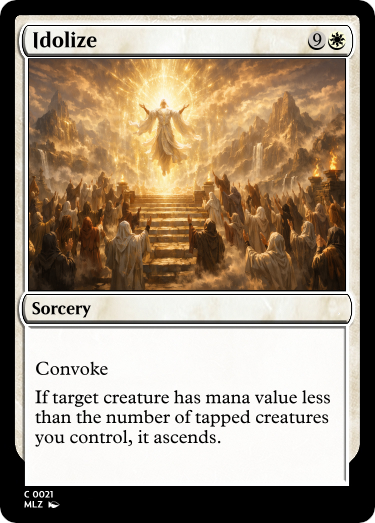 
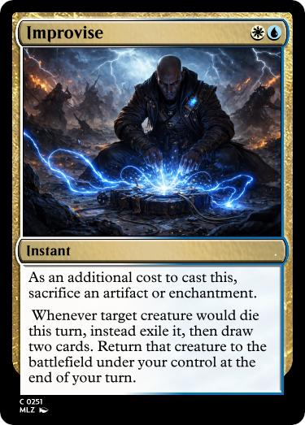 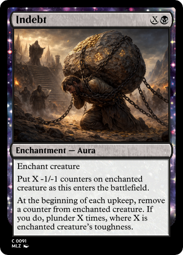  
   
   
   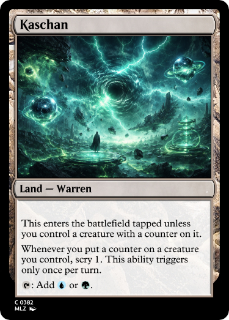
   
  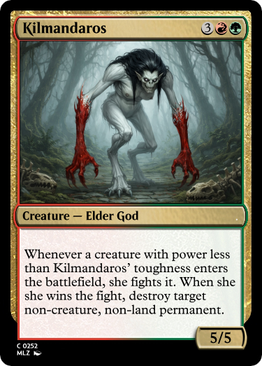 
   
   
   
   
   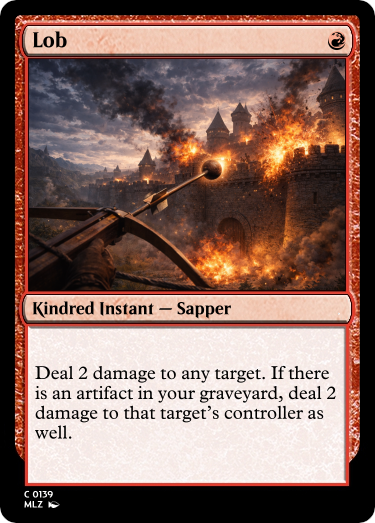
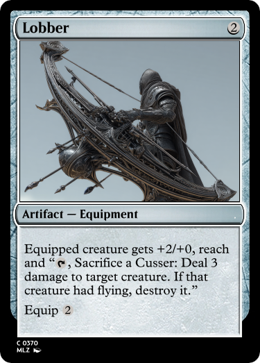   
   
   
   
   
   
   
   
   
   
 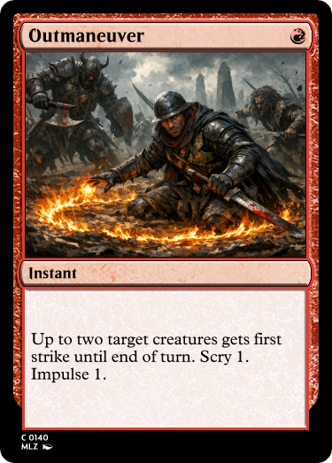 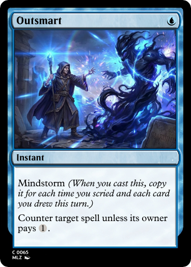 
   
 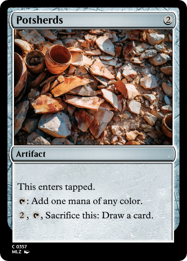  
   
   
   
  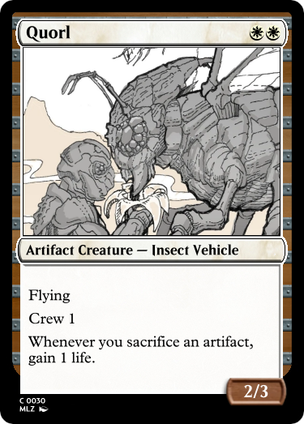 
   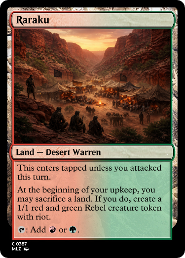
   
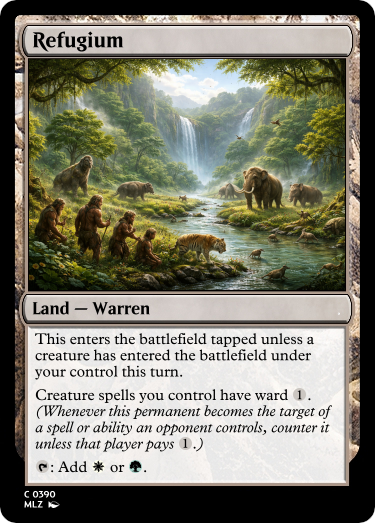   
   
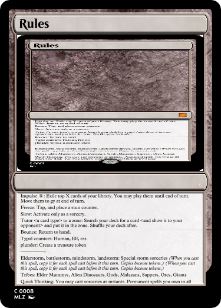  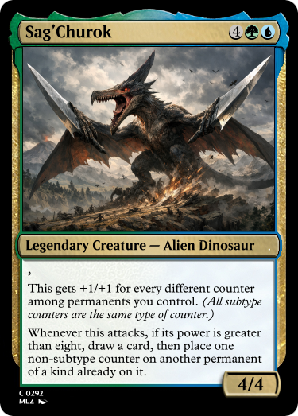 
  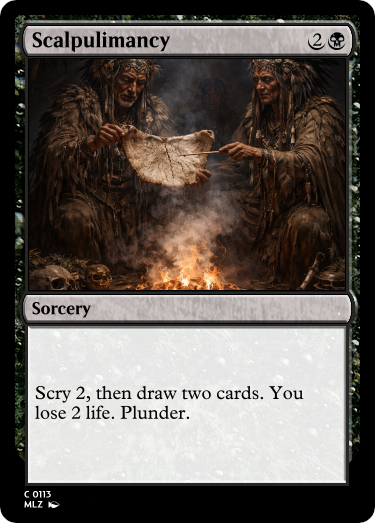 
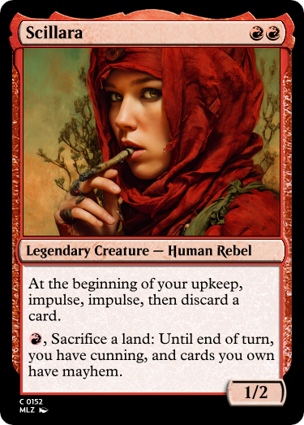   
 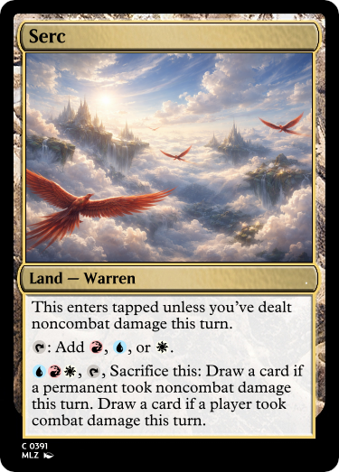  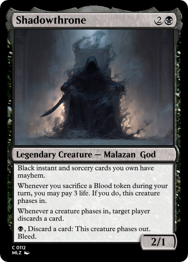
   
   
   
   
   
   
 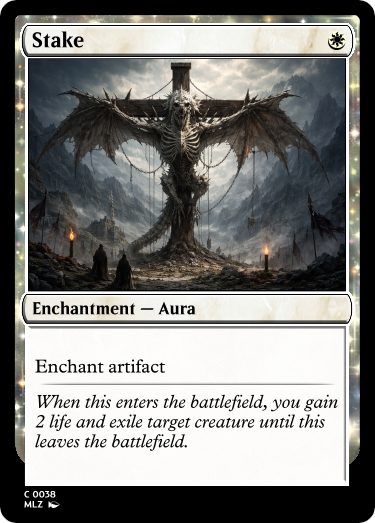  
   
   
   
   
   
   
   
   
   
   
   
   
   
   
   
   
   
   
